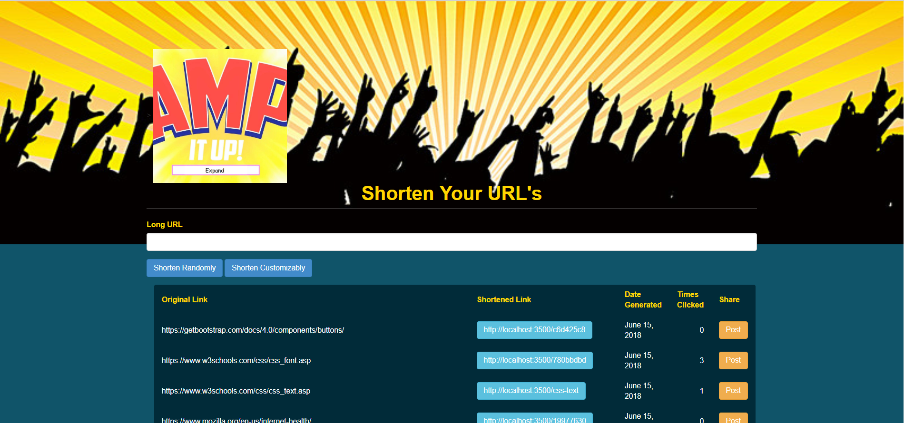

# Node.js + Express.js URL shortener

The server is based on <a href="https://github.com/dukeofharen/urlshortener.js">this repo</a>. There is also a <a href="https://www.codeproject.com/Articles/996559/URL-shortener-in-Node-js-plus-Express-js-plus-MySQL">Blog article which covers the server's basic structure</a>.


## Installation

1. Download the files to the location you would like application to be.
1. Go to the folder with the command line and execute `npm install`, so all dependencies will be installed.
1. In your MySQL database, create a new table and execute `urlshortener.sql`
1. In `constants.js`, fill in the correct MySQL settings and fill in your root URL (e.g. http://d.co/ or http://localhost:3500/)
1. If you install this script on your server and you have a custom short domain, make sure you create a reverse proxy in your Apache or Nginx (or any other server), so your domain (e.g. d.co) points to `http://localhost:3500/` (or any other port number you've configured).


## Note

API Calls:

Get all URL's: 
```
http://localhost:3500/geturls
```

Generate a new shortlink: 
```
http://localhost:3500/add?url=https://www.codeproject.com/Tags/All-Topics
```

Get more info about a specific URL (based on its shortlink/hash):
```
http://localhost:3500/whatis?url=http://facebook.com
```

Create a customized 'vanity' url:
```
http://localhost:3500/add?url=http%3A%2F%2Fmicrosoft.com&vanity=microsoft
```

This script is meant to be used as a public URL shortener. If you want to use this script for personal use, you have to include some sort of authentication.

<h3>Understanding Callback functions within JavaScript</h3>

"For JavaScript to know when an asynchronous operation has a result 
(a result being either returned data or an error that occurred during the operation), 
it points to a function that will be executed once that result is ready. 
This function is what we call a “callback function”."

source: <a href="https://medium.com/codebuddies/getting-to-know-asynchronous-javascript-callbacks-promises-and-async-await-17e0673281ee">"Getting to know asynchronous JavaScript: Callbacks, Promises and Async/Await"</a>

To bring this point home, here is the flow of the logic.js file within this repo.

Main Function Definition:

```javascript
function generateHash(onSuccess, onError, retryCount, url, request, response, con, vanity) {
```

The Main Function In Action:

```javascript
generateHash(handleHash, hashError, 50, url, request, response, con, vanity);
```

Other Function Definitions: i.e. What do the "handleHash" and "hashError functions actually do?"

//The function that is executed when the hash has been created successfully. (i.e. onSuccess handler)

```javascript
function handleHash(hash, url, request, response, con){
	//cons.add_query = 'INSERT INTO urls SET url = {URL}, segment = {SEGMENT}, ip = {IP}';
	con.query(cons.add_query.replace("{URL}", con.escape(url)).replace("{SEGMENT}", con.escape(hash)).replace("{IP}", con.escape(getIP(request))), function(err, rows){
		if(err){
			console.log(err);
		}
	});
	response.send(urlResult(hash, true, 100));
}
```

